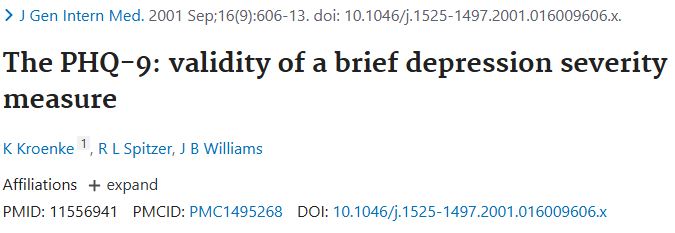

```{r xaringan-setup, include=FALSE, warning=FALSE}
library("xaringanthemer")
library("dplyr")
library("knitr")
library("kableExtra")
extra_css <- list(
  ".tiny" = list(`font-size` = "50%"),
  ".small" =  list(`font-size` = "80%"),
  ".large" =  list(`font-size` = "150%"),
  ".huge" =  list(`font-size` = "300%"),
  "ul li" = list(`margin-bottom` = "10px"),
  ".gray" = list(color = "#C0C0C0"),
  ".red" = list(color = "#FF0000"),
  ".green" = list(color = "#097969"),
  ".blue1" = list(color = "#3AABBE"),
  ".blue2" = list(color = "#2A6D90"),
  ".blue3" = list(color = "#446874"),
  ".purple" = list(color = "#624474"),
  ".mutedred" = list(color = "#745344"),
  "a" = list(color = "#3AABBE"),
  "a:hover" = list("text-decoration" = "underline")
)
# set up fonts
style_mono_accent(
  base_color = "#446874",
  header_font_google = google_font("DM Sans"),
  text_font_google   = google_font("DM Sans", "400", "400i"),
  code_font_google   = google_font("Courier Prime"),
  extra_css = extra_css
)

xaringanExtra::use_tile_view()
```

<style type="text/css">
.remark-slide-content {
    font-size: 20px
    header-h2-font-size: 1.75rem;
}
</style>

## Acknowledgments

This work was done in collaboration with:
```{r acknowledgments, echo = FALSE, fig.show = "hold", out.width="100%", fig.align = "center"}
knitr::include_graphics(c(
    "img/people6.png"
  ))
```

---

## Risk prediction and suicide prevention

Several health systems have implemented suicide risk prediction models based on EHR data:
* designed to predict self-harm in a given window after an index visit (e.g., 90 days)
* often use data from up to 5 years prior to index visit
* many achieve area under the ROC curve (AUC) of 0.8 or above
* can be used at a health care visit to alert clinician .small[[Rossom et al. (2022)]]

.pull-left[
```{r simon2018, echo = FALSE, fig.show="hold", out.width="100%", fig.align="center"}
knitr::include_graphics("img/simon-etal_2018.PNG")
```
]

.pull-right[
```{r screening2024, echo = FALSE, fig.show="hold", out.width="100%", fig.align="center"}

```
]

---

## Risk prediction and suicide prevention

Data include:
* encounter or billing diagnoses
* medications prescribed
* use of specific mental health services
* self-report questionnaires completed during routine care

---

## Risk prediction and suicide prevention

One element of routine care: the patient health questionnaire 9-item (PHQ-9)
* first 8 items summed: a measure of depressive symptoms (PHQ-8)
* ninth item: a separate measure of suicidal ideation (PHQi9)

PHQi9:
* strong predictor of suicide attempt .small[Kroenke et al. (2001), Simon et al. (2013)]
* repeated endorsement are at highest risk of suicide attempt .small[Simon et al. (2016)]

```{r kroenke2001, echo = FALSE, fig.show="hold", out.width="75%", fig.align="center"}

```

---

## Risk prediction and suicide prevention

People seek mental health care over time.

Challenge: incorporating more recent data .small[[Wolock et al. (2024)]]

Opportunity: identifying variables that have stable or varying importance
* impacts which variables clinicians measure over patient care trajectory

Scientific question: what is the trajectory of importance of PHQi9 over time? 

Goal: help guide use of PHQi9 in clinical care .small[[Simon et al. (2016, 2024)]]

---


## Variable importance: what and why

**What is variable importance?**

--

* .blue1[Quantification of "contributions" of a variable] (or a set of variables)

--

  Traditionally: contribution to .blue2[predictions]
--

* Useful to distinguish between contributions of predictions...
--

  * (.blue1[extrinsic importance]) ... .blue1[by a given (possibly black-box) algorithm]
  .small[ [e.g., Breiman (2001)] ]
--

  * (.blue1[intrinsic importance]) ... .blue1[by best possible (i.e., oracle) algorithm]
  .small[ [e.g., van der Laan (2006)] ]
--

* Our work focuses on .blue1[interpretable, model-agnostic intrinsic importance]

--

Example uses of .blue2[intrinsic] variable importance:
* is it worth extracting text from notes in the EHR for the sake of predicting hospital readmission?

--

* does the importance of item 9 on the Patient Health Questionnaire in predicting risk of suicide attempt change over time?


---

## Case study: ANOVA importance

Data unit $(X, Y) \sim P_0$ with:
* outcome $Y$ 
* covariate $X := (X_1, X_2, \ldots, X_p)$

--

**Goals:** 
* .green[estimate]
* .blue1[and do inference on]

the importance of $(X_j: j \in s)$ in predicting $Y$

--

How do we typically do this in **linear regression**?

---

## Case study: ANOVA importance

How do we typically do this in **linear regression**?

* Fit a linear regression of $Y$ on $X$ $\rightarrow \color{magenta}{\mu_n(X)}$
--

* Fit a linear regression of $Y$ on $X_{-s}$ $\rightarrow \color{magenta}{\mu_{n,-s}(X)}$
--

* .green[Compare the fitted values] $[\mu_n(X_i), \mu_{n,-s}(X_i)]$

--

Many ways to compare fitted values, including:
* ANOVA decomposition
* Difference in $R^2$

---

## Case study: ANOVA importance

Difference in $R^2$: $$\left[1 - \frac{n^{-1}\sum_{i=1}^n\{Y_i - \mu_n(X_i)\}^2}{n^{-1}\sum_{i=1}^n\{Y_i - \overline{Y}_n\}^2}\right] - \left[1 - \frac{n^{-1}\sum_{i=1}^n\{Y_i - \mu_{n,-s}(X_i)\}^2}{n^{-1}\sum_{i=1}^n\{Y_i - \overline{Y}_n\}^2}\right]$$

--

&zwj;Inference:
* Test difference
* Valid confidence interval

---

## Case study: ANOVA importance

Consider the .blue1[population parameter] $$\psi_{0,s} = \frac{E_0\{\mu_0(X) - \mu_{0,-s}(X)\}^2}{var_0(Y)}$$

* $\mu_0(x) := E_0(Y \mid X = x)$ .blue1[(true conditional mean)]
* $\mu_{0,-s}(x) := E_0(Y \mid X_{-s} = x_{-s})$ 

  [for a vector $z$, $z_{-s}$ represents $(z_j: j \notin s)$]

--

* .blue2[nonparametric extension] of linear regression-based ANOVA parameter

--

* Can be expressed as a $\color{magenta}{\text{difference in population } R^2}$ values, since $$\color{magenta}{\psi_{0,s} = \left[1 - \frac{E_0\{Y - \mu_0(X)\}^2}{var_0(Y)}\right] - \left[1 - \frac{E_0\{Y - \mu_{0,-s}(X)\}^2}{var_0(Y)}\right]}$$

---

## Case study: ANOVA importance

How should we make inference on $\psi_{0,s}$?
--

1. construct estimators $\mu_n$, $\mu_{n,-s}$ of $\mu_0$ and $\mu_{0,-s}$ (e.g., with machine learning)
--

2. plug in: $$\psi_{n,s} := \frac{\frac{1}{n}\sum_{i=1}^n \{\mu_n(X_i) - \mu_{n,-s}(X_i)\}^2}{\frac{1}{n}\sum_{i=1}^n (Y_i - \overline{Y}_n)^2}$$
--

  but this estimator has .red[asymptotic bias]
--

3. using influence function-based debiasing [e.g., Pfanzagl (1982)], we get estimator $$\color{magenta}{\psi_{n,s}^* := \left[1 - \frac{\frac{1}{n}\sum_{i=1}^n\{Y_i - \mu_n(X_i)\}^2}{\frac{1}{n}\sum_{i=1}^n (Y_i - \overline{Y}_n)^2}\right] - \left[1 - \frac{\frac{1}{n}\sum_{i=1}^n\{Y_i - \mu_{n,-s}(X_i)\}^2}{\frac{1}{n}\sum_{i=1}^n (Y_i - \overline{Y}_n)^2}\right]}$$

--

Under regularity conditions, $\psi_{n,s}^*$ is consistent and nonparametric efficient.

In particular, $\sqrt{n}(\psi_{n,s}^* - \psi_{0,s})$ has a mean-zero normal limit with estimable variance.

[Details in Williamson et al. (2020)]

---

## Generalization to arbitrary measures

ANOVA example suggests a natural generalization:
--

* Choose a relevant measure of .blue1[predictiveness] for the task at hand

--

  * $V(f, P) =$ .blue1[predictiveness] of function $f$ under sampling from $P$
  * $\mathcal{F} =$ rich class of candidate prediction functions
  * $\mathcal{F}_{-s} =$ {all functions in $\mathcal{F}$ that ignore components with index in $s$} $\subset \mathcal{F}$
  
--

* Define the oracle prediction functions

  $f_0:=$ maximizer of $V(f, P_0)$ over $\mathcal{F}$ & $f_{0,-s}:=$ maximizer of $V(f, P_0)$ over $\mathcal{F}_{-s}$

--

Define the importance of $(X_j: j \in s)$ relative to $X$ as $$\color{magenta}{\psi_{0,s} := V(f_0, P_0) - V(f_{0,-s}, P_0) \geq 0}$$

---

## Generalization to arbitrary measures

Some examples of predictiveness measures:

(arbitrary outcomes)

&zwj; $R^2$: $V(f, P) = 1 - E_P\{Y - f(X)\}^2 / var_P(Y)$

--

(binary outcomes)

Classification accuracy: $V(f, P) = P\{Y = f(X)\}$

&zwj;AUC: $V(f, P) = P\{f(X_1) < f(X_2) \mid Y_1 = 0, Y_2 = 1\}$ for $(X_1, Y_1) \perp (X_2, Y_2)$

Pseudo- $R^2$ : $1 - \frac{E_P[Y \log f(X) - (1 - Y)\log \{1 - f(X)\}]}{P(Y = 1)\log P(Y = 1) + P(Y = 0)\log P(Y = 0)}$

---

## Generalization to arbitrary measures

How should we make inference on $\psi_{0,s}$?
--

1. construct estimators $f_n$, $f_{n,-s}$ of $f_0$ and $f_{0,-s}$ (e.g., with machine learning)
--

2. plug in: $$\psi_{n,s}^* := V(f_n, P_n) - V(f_{n,-s}, P_n)$$
  
  where $P_n$ is the empirical distribution based on the available data
--

3. Inference can be carried out using influence functions.
--
 Why?

We can write $V(f_n, P_n) - V(f_{0}, P_0) \approx \color{green}{V(f_0, P_n) - V(f_0, P_0)} + \color{blue}{V(f_n, P_0) - V(f_0, P_0)}$
--

* the $\color{green}{\text{green term}}$ can be studied using the functional delta method
* the $\color{blue}{\text{blue term}}$ is second-order because $f_0$ maximizes $V$ over $\mathcal{F}$

--

In other words: $f_0$ and $f_{0,-s}$ **can be treated as known** in studying behavior of $\psi_{n,s}^*$!

[Details in Williamson et al. (2022)]

---

## Longitudinal VIMs

So far: cross-sectional variable importance

Can we do inference on variable importance longitudinally?

```{r longitudinal-vim, echo = FALSE, fig.show = "hold", out.width = "60%", fig.align = "center", message=FALSE, warning=FALSE}
knitr::include_graphics(c(
    "img/lvim_example.png"
  ))
```

---

## Summarizing a VIM trajectory

&zwj;Define: 
* contiguous set of timepoints $\tau := [t_0, \ldots, t_1]$
* variable importance at each time point $\psi_{0,s,\tau} = (\psi_{0,s,t_0}, \ldots, \psi_{0,s,t_1})$

--

Examples of summary measures over $\tau$, $m(\psi_{0,s,\tau})$:

&zwj;Mean: $\lVert \tau \rVert^{-1} \sum_{t \in \tau} \psi_{0,s,t}$

--

Linear trend: $(\beta_0, \beta_1) = \text{arg min}_{(\alpha_1, \alpha_2) \in \mathbb{R}^2} \lVert \psi_{0,s,\tau} - \alpha_1  - \tau \alpha_2\rVert_2^2$

---

## Summarizing a VIM trajectory

```{r longitudinal-vim-2, echo = FALSE, fig.show = "hold", out.width = "40%", fig.align = "center", message=FALSE, warning=FALSE}
knitr::include_graphics(c(
    "img/lvim_example.png"
  ))
```

| Summary | VIM 1 | VIM 2 | VIM 3 |
|:-------:--------:-------:-------|
| Mean    | 0.3   | 0.8   | 0.06  |
| Slope   | 0.1   | 0     | -0.05 |

---

## Summarizing a VIM trajectory

How should we make inference on $m(\psi_{0,s,\tau})$?
--

1. construct estimators $f_{n,t}$, $f_{n,-s,t}$ of $f_{0,t}$, $f_{0,-s,t}$ (e.g., with machine learning)

--

2. plug in: $\psi_{n,s,t}^* = V(f_{n,s,t}, P_{n,s,t}) - V(f_{n,-s,t}, P_{n,s,t})$ 

--

3. plug in: $$m_{n,s}^* := m(\psi_{n,s,\tau}^*)$$

--

4. Inference can be carried out using influence functions.

[Details in Williamson et al. (2024)]

---

## Key considerations

.blue1[Reference group of variables]
* importance of $(X_j: j \in s)$ relative to $X$: $$\color{magenta}{\psi_{0,s} := V(f_0, P_0) - V(f_{0,-s}, P_0) \geq 0}$$
* set of variables $X_{-s}$ changes interpretation!
* common choices of $X_{-s}$:
  * a _base set_ of variables to always adjust for (e.g., confounders) -> "add-in" VIM
  * all variables except the variable(s) of interest -> "leave-out" VIM

.blue2[Correlation over time]
* updated theory handles outcome and feature correlation over time

---

## VIMs for predictors of suicide risk

Data gathered from electronic health record on sample of 343,950 visits made by 184,782 people

Key variables: .small[ Jacobs et al. (2010) ]
* Patient Health Questionnaire (PHQ)
  * PHQ-8 total score (depressive symptoms) 
  * PHQi9 (suicidal ideation)
* Prior recorded self-harm
* Age
* Sex (sex assigned at birth)

Outcome: suicide attempt in 90 days following mental health visit

Sampled one visit per person at six possible measurement times over 18 months:
* 99,991 people had only one visit
* 4,093 people had six visits
* Rate of suicide attempt approximately 0.5% at all time points

---

## VIMs for predictors of suicide risk

&zwj;Goal: estimate VIMs for PHQi9 and prior recorded self-harm

Variable sets considered:
1. no variables
2. PHQi9 alone
3. age and sex (base set)
4. age, sex, and PHQi9
5. age, sex, and prior self-harm
6. age, sex, prior self-harm, and PHQi9

--

Estimate prediction functions at each time point using the super learner [ van der Laan et al. (2007) ]

---

## VIMs for predictors of suicide risk

```{r data-analysis-1, echo = FALSE, fig.show = "hold", out.width = "100%", fig.align = "center", message=FALSE, warning=FALSE}
knitr::include_graphics(c(
    "img/vims_of_interest_over_time_presentation.png"
  ))
```

---

## VIMs for predictors of suicide risk

```{r data-analysis-2, echo = FALSE, fig.show = "hold", out.width = "100%", fig.align = "center", message=FALSE, warning=FALSE}
knitr::kable(readRDS(file = "img/vim_summaries_presentation.rds") %>% 
               filter(grepl("PHQi9", Comparison, fixed = TRUE))) %>% 
  kableExtra::kable_styling(font_size = 14)
```

---

## VIMs for predictors of suicide risk

Overall conclusions:
* Prediction model performance stable over time
* PHQi9 is stably important over time
  * large mean importance
  * slope near zero
  
Implication: PHQi9 should be obtained and focused on in all visits

---

## Closing thoughts

.blue1[Population-based] variable importance:
* wide variety of meaningful measures
* simple estimators
* machine learning okay
* valid inference, testing
* extension to longitudinal VIMs
* extension to correlated features .small[ (Williamson and Feng, 2020) ]

.pull-left[
Check out the software:
* R packages [`vimp`](https://github.com/bdwilliamson/vimp), [`lvimp`](https://github.com/bdwilliamson/lvimp)
* [Python package `vimpy`](https://github.com/bdwilliamson/vimpy)
]
.pull-right[
Check out the paper:
```{r qrcode, echo = FALSE, fig.show = "hold", out.width="40%", fig.align = "center"}

```
]
`r icons::fontawesome('github')` https://github.com/bdwilliamson | `r icons::fontawesome('globe')` https://bdwilliamson.github.io

---

## References

* .small[ Breiman L. 2001. Random forests. _Machine Learning_.]
* .small[ Kroenke et al. 2001. The PHQ-9: Validity of a brief depression severity measure. _Journal of General Internal Medicine_. ]
* .small[ Rossom et al. 2022. Connecting research and practice: implementation of suicide prevention strategies in learning health care systems. _Psychiatric Services_.]
* .small[ Simon et al. 2013. Does response on the PHQ-9 depression questionnaire predict subsequent suicide attempt or suicide death? _Psychiatric Services_.]
* .small[ Simon et al. 2016. Risk of suicide attempt and suicide death following completion of the patient health questionnaire depression module in community practice. _The Journal of Clinical Psychiatry_.]
* .small[ Simon et al. 2024. Stability of suicide risk prediction models during changes in health care delivery. _Psychiatric Services_.]
* .small[ van der Laan MJ. 2006. Statistical inference for variable importance. _The International Journal of Biostatistics_.]
* .small[ van der Laan MJ, Polley EC, and Hubbard AE. 2007. Super Learner. _Statistical Applications in Genetics and Molecular Biology_. ]

---

## References
* .small[ Williamson BD, Gilbert P, Carone M, and Simon N. 2020. Nonparametric variable importance assessment using machine learning techniques (+ rejoinder to discussion). _Biometrics_. ]
* .small[ Williamson BD, Gilbert P, Simon N, and Carone M. 2022. A general framework for inference on algorithm-agnostic variable importance. _Journal of the American Statistical Association_. ]
* .small[ Williamson BD, Moodie EEM, Simong GE, Rossom RC, and Shortreed SM. 2024. Inference on summaries of a model-agnostic longitudinal variable importance trajectory. _arXiv https://arxiv.org/pdf/2311.01638.pdf_. ]
* .small[ Williamson BD and Feng J. 2020. Efficient nonparametric statistical inference on population feature importance using Shapley values. _ICML_. ]
* .small[ Wolock CJ et al. 2024. Importance of variables from different time frames for predicting self-harm using health system data. _Journal of Biomedical Informatics_. ]

